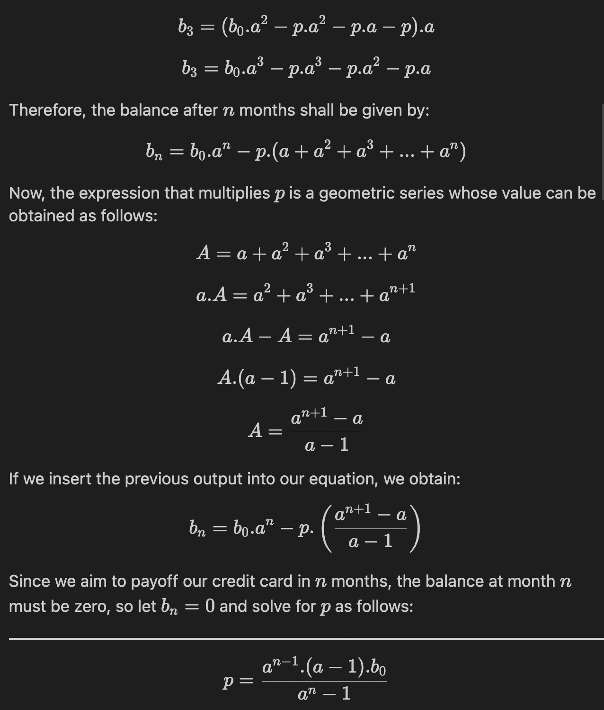

# Credit Card Payoff: Mathematical and Programming approach

Credit cards may set a minimum monthly payment - or floor - but paying the minimum each month does not guarantee that you are going to go debt free anytime soon, so how much should you pay in a monthly basis in order to payoff your credit card after $n$ months?

Here, we provide two methods to answer this question:

| Approach     | Method           |
| ------------ | ---------------- |
| Mathematical | Geometric series |
| Programming  | Bisection search |

This exercise is a neat example of approaching a problem from different, although related, disciplines.

### Requirements

Matplotlib is required to replicate the plot shown on the jupiter notebook. You may install it through `python -m pip install matplotlib` or by running `python -m pip install -r requirements.txt`.

> This exercise was inspired by one of the assingments from [MITx's Introduction to Computer Science and Programming Using Python](https://www.edx.org/es/course/introduction-to-computer-science-and-programming-7).
